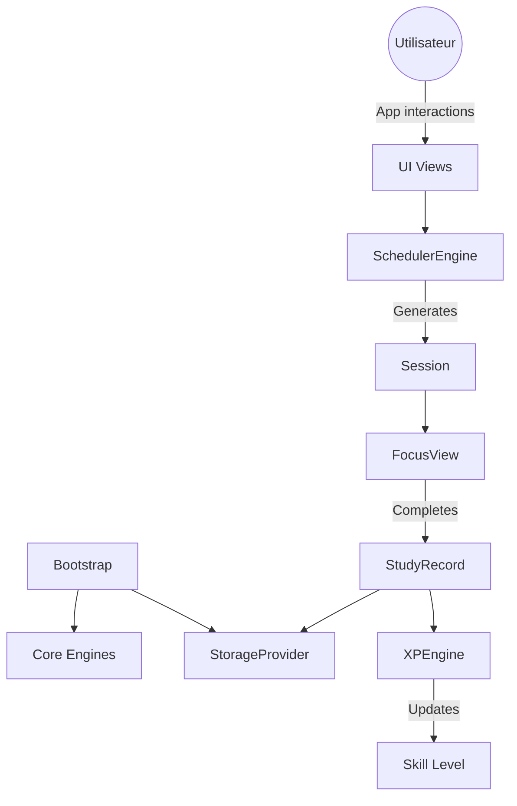

# Learning OS - Architecture Documentation

## Philosophie du Projet
Ce projet est un **Learning Operating System (Learning OS)**, pas un simple agenda ou LMS. Il planifie, priorise, mesure, adapte et suit les compétences acquises.
Il repose sur la Clean Architecture et le principe de responsabilité unique (SOLID). La base de code est conçue pour évoluer vers l'intelligence artificielle (Phase 2), mais le MVP se concentre sur l'exécution robuste et la motivation.

## Diagramme des Flux (Data Flow)

## Conventions de Code
- **Casse (Variables & Fonctions)** : `camelCase` (ex: `xpEarned`).
- **Casse (Classes & Composants)** : `PascalCase` (ex: `StudyRecord`).
- **Noms des fichiers** : `PascalCase.js` pour les classes/vues/moteurs (ex: `SchedulerEngine.js`), `camelCase.js` pour les utilitaires (ex: `config.js`).
- **Langue interne** : Anglais pour le code source (variables, architecture, commentaires techniques), Français pour l'interface UI visible par l'utilisateur.
- **Dates** : Format ISO 8601 strict (`YYYY-MM-DDTHH:mm:ss.sssZ`).
- **Stockage JSON** : Toujours versionné avec `schemaVersion`.
- **Modules** : Utilisation d'ES6 Modules (`import` / `export`).

## Interfaces des Modèles (Domain Model)
- **User** : `id`, `name`, `streak`, `schemaVersion`.
- **Skill** : `id`, `name`, `level`, `xp`, `totalHours`, `evidence`.
- **Session** : `id`, `skillId`, `expectedDuration`, `energyRequired`, `priority`, `resourceId`.
- **StudyRecord** : `id`, `sessionId`, `date`, `startTime`, `endTime`, `realDuration`, `completed`, `xpEarned`, `quality`, `notes`.
- **Goal** : `id`, `title`, `milestones`.
- **Project** : `id`, `title`, `status`, `tasks`.
- **Event** : `id`, `type`, `date`, `priority`, `mandatory`, `impact`.
- **Resource** : `id`, `name`, `url`, `icon`.

## Contrats des Moteurs (Engines)
### SchedulerEngine
- **Entrées** : `bootcamp.json`, `events.json`, état des sessions précédentes.
- **Sorties** : Liste ordonnée de `Session` pour la journée en cours.
- **Responsabilités** : Générer le planning du jour.
- **Ne fait PAS** : N'optimise pas l'énergie (c'est le rôle futur de `OptimizerEngine`), ne stocke pas les données.

### XPEngine
- **Entrées** : Object `StudyRecord`.
- **Sorties** : Nombre entier (XP).
- **Responsabilités** : Appliquer la formule `baseXP × difficulty × completionRate × quality × streakBonus`.
- **Ne fait PAS** : Ne met pas à jour le profil User directement (retourne juste la valeur brute).

## Gestion de l'État (State Management)
Pour le MVP, l'état global vit dans le navigateur et est géré par le `StorageProvider` (via `LocalStorage`). 
Le fichier central `Bootstrap.js` charge l'état au démarrage, initialise les moteurs, puis injecte l'état dans les vues (ex: `DashboardView`).

## Critères de Réussite du MVP (V1.0)
La V1 sera considérée comme terminée et livrable quand :
1. Le planning se génère correctement en lisant un fichier JSON.
2. Le mode Focus fonctionne et chronomètre une tâche.
3. Les sessions peuvent être validées, créant un `StudyRecord`.
4. L'XP est calculée et s'affiche.
5. Les données survivent à un redémarrage complet du navigateur.
6. L'export/import JSON restaure complètement et fidèlement une sauvegarde.

## Roadmap Évolutive
- **V1.0** : MVP (Scheduler, Focus, Dashboard minimal, XP, Export/Import).
- **V1.1** : Statistiques avancées et graphiques.
- **V1.2** : Répétition espacée (Review Engine).
- **V1.3** : Notifications système avancées.
- **V2** : Knowledge Engine (concept tracking) & Risk Engine (détection d'abandon).
- **V3** : IA de Coaching et recommandations quotidiennes (Daily Reviews).
